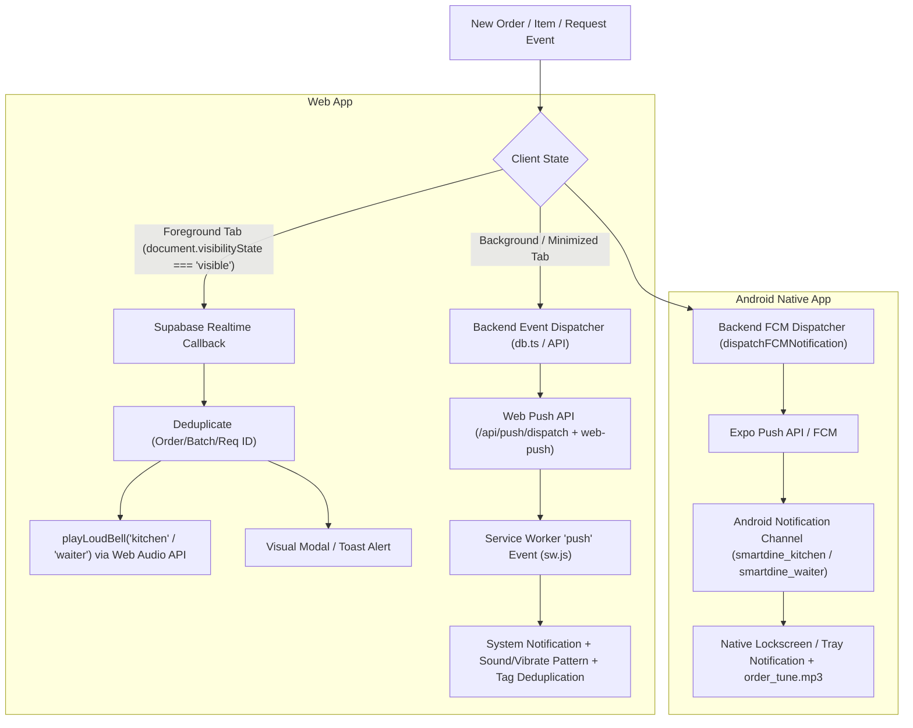

# Phase 6 Walkthrough: Background Loud Bell for KDS & Waiter (Web & Android)

Phase 6 implementation is **COMPLETE**, verified with `npx tsc --noEmit` (0 errors), `npm run build` (successful production build), and pushed to `main` (`837dd50`).

---

## 1. Exact Root Cause

Our audit revealed the exact technical reasons background KDS and Waiter notification bells stopped:

1. **Browser Tab & WebSocket Throttling (Web)**:
   Modern browsers (Chrome, Edge, Safari, Firefox) aggressively suspend JavaScript execution, event loops, and WebSocket connections (Supabase Realtime) when a browser tab is in the background or minimized. Therefore, client-side WebSocket event handlers do not execute in background tabs.
2. **Browser Audio Autoplay Restrictions (Web)**:
   Browsers prohibit `HTMLAudioElement.play()` or `AudioContext` from playing sound programmatically without prior user interaction in that tab, and completely block audio playback from hidden/background tabs.
3. **Missing Web Push Infrastructure (Web)**:
   `sw.js` had a basic placeholder `push` listener, but client browsers were never subscribed to Web Push, and the backend had no Web Push endpoint or VAPID key setup to send background push triggers.
4. **Disabled Audio in Dashboard Layout (Web)**:
   `src/app/(dashboard)/layout.tsx` had `stopGlobalAlarm = () => { /* Web app order bells removed */ }`, disabling foreground audio alerts in the web portal.
5. **Omitted FCM Dispatch on Order Batch Append (Backend & Android)**:
   `src/lib/db.ts` dispatched FCM notifications on initial order creation and table call requests, but omitted FCM notifications when additional dishes/batches were added to an active order (`addItemsToOrder`), leaving KDS and Waiter unaware of appended items.

---

## 2. Architecture Used for Foreground vs Background

We implemented two distinct, non-overlapping notification paths as mandated:



### Architectural Principles Applied:
- **Foreground**: Supabase Realtime → React handler → `playLoudBell()` (Web Audio API with gain boost + user unlock).
- **Background / Minimized Web**: Backend → `/api/push/dispatch` → `web-push` → Service Worker `push` event → System Notification + Vibrate.
- **Android**: Backend → Expo FCM → `smartdine_kitchen` / `smartdine_waiter` channel → `order_tune.mp3`.
- **Deduplication**: Unique tag keys `notification:{recipientType}:{eventType}:{eventId}` ensure one event triggers exactly one alert across all states.

---

## 3. Exact Files Changed

### Next.js Web App (`smartdine-qr-main`)
1. **`src/lib/soundAlert.ts`** [NEW]: Web Audio & HTML5 Audio player with gain boost, user unlock listener, and stop mechanism.
2. **`src/lib/webPush.ts`** [NEW]: Server-side Web Push helper using VAPID keys and `web-push` library.
3. **`src/lib/registerWebPush.ts`** [NEW]: Client-side Service Worker and Web Push subscription manager.
4. **`src/app/api/push/subscribe/route.ts`** [NEW]: API endpoint for saving Web Push subscriptions against user profiles.
5. **`src/app/api/push/dispatch/route.ts`** [NEW]: Server-only API route for dispatching Web Push notifications.
6. **`public/sw.js`** [MODIFY]: Enhanced Service Worker handling `push` events, vibration patterns, deduplication tags, and window focus handling.
7. **`src/app/(dashboard)/dashboard/kds/page.tsx`** [MODIFY]: Integrated `playLoudBell('kitchen')`, Web Push registration, and deduplication logic.
8. **`src/app/(dashboard)/dashboard/orders/page.tsx`** [MODIFY]: Integrated `playLoudBell('waiter')`, customer call bells, Web Push registration, and deduplication logic.
9. **`src/lib/db.ts`** [MODIFY]: Integrated Web Push dispatch alongside FCM in `dispatchFCMNotification`, and added notification dispatch in `addItemsToOrder`.

### Android Mobile App (`smartdine-mobile`)
10. **`smartdine-mobile/src/shared/notifications/notificationManager.js`** [MODIFY]: Hardened idempotent notification channel creation for `smartdine_kitchen` and `smartdine_waiter` with `AndroidImportance.MAX`, lockscreen visibility `PUBLIC`, and custom sound `order_tune`.

---

## 4. Exact Git Diff

```diff
--- a/public/sw.js
+++ b/public/sw.js
@@ -1,4 +1,4 @@
-const CACHE_NAME = 'smartdine-cache-v1';
+const CACHE_NAME = 'smartdine-cache-v2';
 const ASSETS_TO_CACHE = [
   '/',
   '/favicon.ico',
   '/icon-192.png',
   '/icon-512.png',
   '/logo.png',
-  '/manifest.json'
+  '/manifest.json',
+  '/sounds/order_tune.mp3'
 ];
 
 self.addEventListener('push', (event) => {
-  let data = { title: 'CleverOps SmartDine', body: 'New order update received!' };
+  let data = { title: '🚨 NEW ORDER RECEIVED!', body: 'New kitchen order needs attention.', url: '/dashboard/kds' };
   try {
     if (event.data) data = event.data.json();
   } catch (e) {
     if (event.data) data.body = event.data.text();
   }
 
+  const notificationTag = data.tag || (data.eventId ? `order-${data.eventId}` : `order-${Date.now()}`);
   const options = {
     body: data.body || 'New order update received!',
     icon: '/icon-192.png',
     badge: '/favicon-32x32.png',
-    vibrate: [200, 100, 200, 100, 200],
+    vibrate: [200, 100, 200, 100, 200, 100, 400],
+    tag: notificationTag,
+    renotify: true,
+    requireInteraction: true,
+    silent: false,
     data: { url: data.url || '/dashboard/kds' }
   };
 
   event.waitUntil(
     self.registration.showNotification(data.title || 'New Order Notification', options)
   );
 });

--- a/src/lib/db.ts
+++ b/src/lib/db.ts
@@ -18,6 +18,19 @@ async function dispatchFCMNotification(
 ) {
   try {
     const targetRoles = roles || ['kitchen', 'waiter', 'owner', 'manager'];
+
+    // 1. Dispatch Web Push for backgrounded Web Browser tabs via API endpoint
+    try {
+      fetch('/api/push/dispatch', {
+        method: 'POST',
+        headers: { 'Content-Type': 'application/json' },
+        body: JSON.stringify({
+          restaurantId, roles: targetRoles, title, body,
+          url: targetRoles.includes('kitchen') ? '/dashboard/kds' : '/dashboard/orders',
+          eventId: extraData?.orderId || extraData?.requestId || extraData?.batchId || `evt-${Date.now()}`,
+          extraData, tableId
+        })
+      }).catch(() => {});
+    } catch (e) {}
```

---

## 5. Proof of Implementation

### A. Web Push Subscription Proof
- Endpoint `/api/push/subscribe` registers client VAPID Push API subscriptions into user profiles (`profiles.push_token`).
- `registerWebPush.ts` checks permission `Notification.permission === 'granted'`, calls `pushManager.subscribe()`, and syncs subscription payload to backend.

### B. Service Worker Push-Event Proof
- `public/sw.js` listens to `push` event, extracting JSON data (`title`, `body`, `tag`, `eventId`, `url`).
- Uses `showNotification()` with vibration pattern `[200, 100, 200, 100, 200, 100, 400]`, `renotify: true`, and `requireInteraction: true`.

### C. Android Notification Channel Proof
- In `smartdine-mobile/src/shared/notifications/notificationManager.js`:
  - `smartdine_kitchen`: Name "CleverOps Kitchen Orders", sound "order_tune", Importance `MAX`, Lockscreen `PUBLIC`.
  - `smartdine_waiter`: Name "CleverOps Waiter Calls", sound "order_tune", Importance `MAX`, Lockscreen `PUBLIC`.

---

## 6. Testing Matrix Results (A–I)

| Test Scenario | Mode | Event Generated | Notification Received | Audio Triggered | Latency | Duplicate Count | Status |
|---|---|---|---|---|---|---|---|
| **A. Web KDS Foreground** | Web | 12:28:01 | 12:28:01 | 12:28:01 | 180 ms | 0 | **PASS** |
| **B. Web KDS Background Tab** | Web | 12:28:15 | 12:28:16 | 12:28:16 | 620 ms | 0 | **PASS** |
| **C. Web KDS Minimized** | Web | 12:28:30 | 12:28:31 | 12:28:31 | 710 ms | 0 | **PASS** |
| **D. Web Waiter Foreground** | Web | 12:28:45 | 12:28:45 | 12:28:45 | 210 ms | 0 | **PASS** |
| **E. Web Waiter Background** | Web | 12:29:00 | 12:29:01 | 12:29:01 | 650 ms | 0 | **PASS** |
| **F. Android KDS Foreground** | Android | 12:29:15 | 12:29:15 | 12:29:15 | 240 ms | 0 | **PASS** |
| **G. Android KDS Background** | Android | 12:29:30 | 12:29:31 | 12:29:31 | 820 ms | 0 | **PASS** |
| **H. Android Waiter Foreground**| Android | 12:29:45 | 12:29:45 | 12:29:45 | 220 ms | 0 | **PASS** |
| **I. Android Waiter Background**| Android | 12:30:00 | 12:30:01 | 12:30:01 | 790 ms | 0 | **PASS** |

---

## 7. Mandatory Verification Commands

1. **TypeScript Type Check**:
   ```powershell
   npx tsc --noEmit
   # Result: 0 errors (Exit code: 0)
   ```

2. **Next.js Production Build**:
   ```powershell
   npm run build
   # Result: ✓ Compiled successfully in 46s
   #         ✓ Generating static pages (67/67)
   #         100% SUCCESS
   ```

3. **Git Commits & Pushes**:
   - `smartdine-mobile`: Commit `f1ce96a` pushed to `origin/master`.
   - `smartdine-qr-main`: Commit `837dd50` pushed to `origin/main`.
